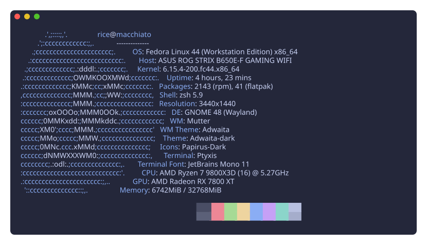
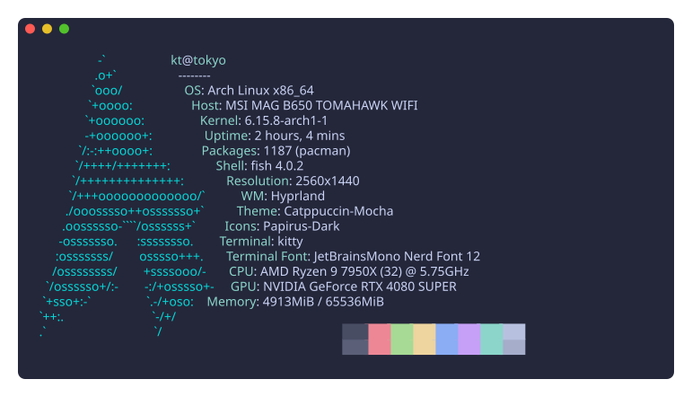
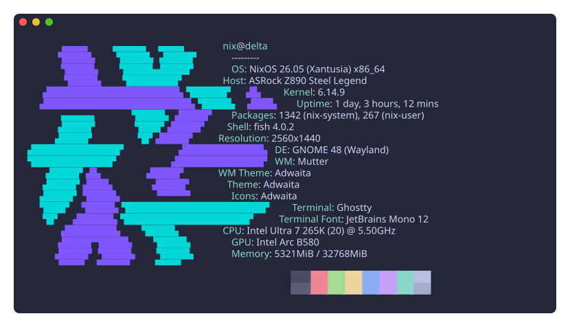
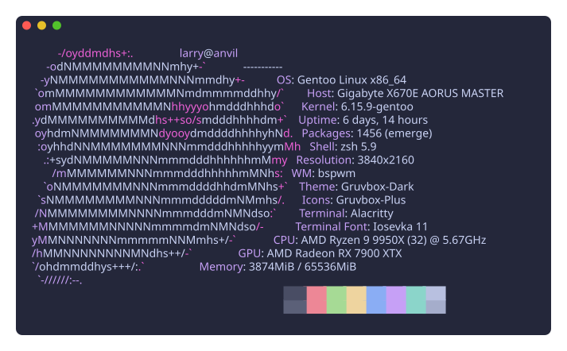
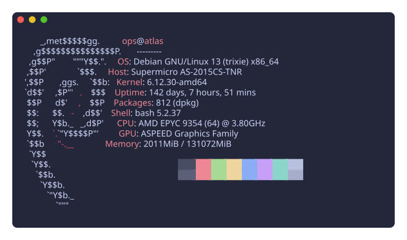
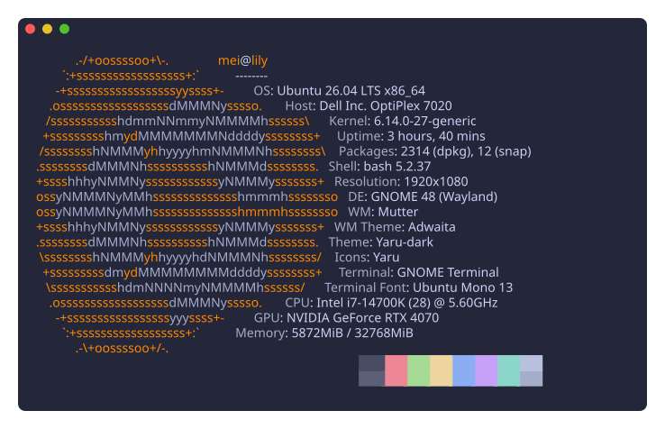
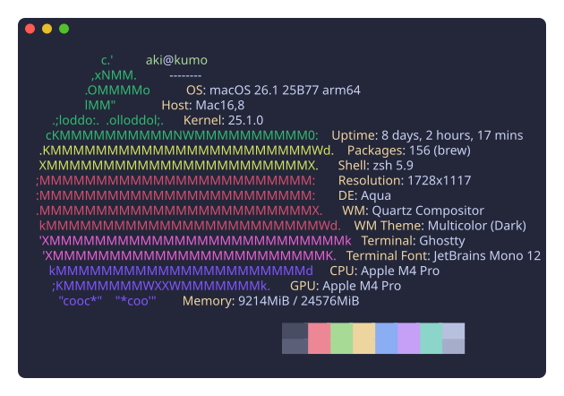
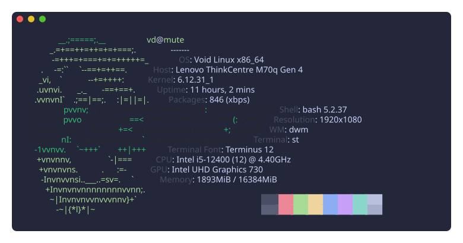

# purr

Fast, universal, cross-platform fetching tool written in Rust.

Perfect for sharing your [rice](https://www.reddit.com/r/unixporn/) or showing stats on terminal startup.

<p align="center">
  <a href="https://crates.io/crates/purrfetch"></a>
  <a href="https://github.com/justin13888/purrfetch/actions/workflows/ci.yml"></a>
  <a href="https://crates.io/crates/purrfetch"></a>
  <a href="LICENSE"></a>
</p>

> **purr is v1 — stable and actively maintained.** A fast, memory-safe, drop-in
> successor to the archived [neofetch](https://github.com/dylanaraps/neofetch).

<p align="center">
  
</p>

## Why purr?

[neofetch](https://github.com/dylanaraps/neofetch) is archived and no longer maintained. If its look is part of your terminal-startup ritual — the thing you see every time a shell opens — purr keeps exactly that: the same fields, the same `${c1}`..`${c6}` ASCII, the same vibe. The difference is it's **instant** instead of the visible pause neofetch takes to start. It's an actively maintained [drop-in successor for Linux, macOS, and Windows](#installation).

- **Fast**: probes run in parallel on native Rust; a typical run finishes in ~20 ms — roughly **91× faster** than neofetch's ~2 s
- **Cross-platform**: Linux, macOS, and Windows
- **neofetch-compatible**: matches neofetch's commonly-used info fields, styling, configuration, and `${c1}`..`${c6}` ASCII format. The [parity matrix](docs/neofetch-parity.md) records exactly what's covered and what's intentionally deferred
- **Highly customizable**: TOML config plus CLI flags for separators, colours, per-field options, color blocks, ASCII overrides, JSON output, and a Kitty image backend
- **Modern neofetch replacement**: memory-safe, maintained, and shipped through release-tested channels for Windows, macOS, and Linux

## Gallery

Every render below is a real `purr` run against a curated example preset — try
them yourself with `purr --example <preset>` on any machine, whatever distro
you're actually on. (The hero image above is `purr --example fedora-desktop`.)

| | |
|---|---|
|  `purr --example arch` |  `purr --example nixos` |
|  `purr --example gentoo` |  `purr --example debian-server` |
|  `purr --example ubuntu` |  `purr --example macos` |
|  `purr --example void` | |

## How purr compares

purr's goal is narrow on purpose: **be the neofetch you already know, without
the wait or the abandonware.** If you're choosing a fetch tool:

- **[neofetch](https://github.com/dylanaraps/neofetch)** — the original, archived
  since 2024. purr replicates its default look, fields, flags, and `${c1}`..`${c6}`
  ASCII format (the [parity matrix](docs/neofetch-parity.md) tracks every field),
  while starting in ~20 ms instead of ~2 s. If you want neofetch, maintained and
  fast, that's purr.
- **[fastfetch](https://github.com/fastfetch-cli/fastfetch)** — an excellent,
  very featureful neofetch successor in C with its own JSONC configuration and a
  broader module set. purr trades that breadth for neofetch-style TOML/flag
  compatibility, a smaller single binary, and memory safety (Rust).
- **[macchina](https://github.com/Macchina-CLI/macchina)** — a minimal,
  aesthetics-focused fetch tool in Rust with its own distinct look. purr shares
  its probe engine ([libmacchina](https://github.com/Macchina-CLI/libmacchina))
  but targets neofetch's look and configuration surface instead.

What purr deliberately does **not** do: neofetch's arbitrary-bash `print_info`
scripting, its 60+ package-manager matrix, or the w3m-era image backends
(kitty is supported; the rest are [intentionally deferred](docs/neofetch-parity.md)).
Benchmarks against all three are reproducible via
[`scripts/bench-compare.sh`](scripts/bench-compare.sh).

## Installation

Official installation support is intentionally limited to channels exercised
end to end before every release:

| OS | Recommended path | Supported GitHub builds |
|---|---|---|
| Linux | Shell installer; Homebrew is an alternative | x86_64 and aarch64 `.tar.xz` archives |
| macOS | Homebrew | Intel and Apple Silicon `.tar.xz` archives; shell installer |
| Windows | PowerShell installer or MSI | x86_64 `.zip` and `.msi` |

All files are available on the
[latest GitHub release](https://github.com/justin13888/purrfetch/releases/latest).

### Linux

Use the shell installer:

```bash
curl --proto '=https' --tlsv1.2 -LsSf https://github.com/justin13888/purrfetch/releases/latest/download/purrfetch-installer.sh | sh
```

For a manual installation, download
`purrfetch-x86_64-unknown-linux-gnu.tar.xz` or
`purrfetch-aarch64-unknown-linux-gnu.tar.xz` from the latest release.
Homebrew is also supported:

```bash
brew install justin13888/tap/purr
```

### macOS

Homebrew is recommended on both Intel and Apple Silicon:

```bash
brew install justin13888/tap/purr
```

The shell installer is also supported:

```bash
curl --proto '=https' --tlsv1.2 -LsSf https://github.com/justin13888/purrfetch/releases/latest/download/purrfetch-installer.sh | sh
```

For a manual installation, download `purrfetch-x86_64-apple-darwin.tar.xz`
for Intel or `purrfetch-aarch64-apple-darwin.tar.xz` for Apple Silicon.

### Windows

Use the PowerShell installer:

```powershell
powershell -ExecutionPolicy Bypass -c "irm https://github.com/justin13888/purrfetch/releases/latest/download/purrfetch-installer.ps1 | iex"
```

The latest release also provides
`purrfetch-x86_64-pc-windows-msvc.msi` and a portable
`purrfetch-x86_64-pc-windows-msvc.zip`.

### Cargo

[Install Rust](https://www.rust-lang.org/tools/install), then choose the stable
crates.io release or the current Git branch:

```bash
# Stable release from crates.io
cargo install --locked purrfetch

# Current master from Git
cargo install --locked --git https://github.com/justin13888/purrfetch.git purrfetch
```

### Mise

[Mise](https://mise.jdx.dev/) installs purr through its Cargo backend, so Rust
must already be installed:

```bash
# Stable release from crates.io
mise use -g cargo:purrfetch@latest

# Current master from Git
mise use -g cargo:https://github.com/justin13888/purrfetch@branch:master
```

Homebrew installs `man purr` and bash, zsh, and fish completions. GitHub
archives bundle the same files for manual installation. On Windows,
`purr.ps1` ships in the ZIP and MSI; dot-source it from your PowerShell
`$PROFILE` to enable completion.

### Deferred distribution channels

`.deb`, `.rpm`, Nix, winget, Scoop, Alpine, AUR/Arch, and Fedora COPR are
deferred pending demonstrated demand and repeatable end-to-end validation.
Dormant prototype recipes remain in the repository, but may be stale and are
not official installation channels. See the
[packaging support matrix](packaging/README.md) for the maintainer policy.

## Usage

Run `purr` with no arguments for the neofetch-style output. Useful flags:

| flag | effect |
|---|---|
| `--all` | show every probe |
| `--json` | structured JSON output |
| `--example [preset]` | render curated example data instead of live info (see [Gallery](#gallery)) |
| `-L`/`--logo`, `--off` | logo only · no logo |
| `--ascii_distro <name>` | force a distro logo |
| `--ascii_colors "4 6 1"` | recolour the logo |
| `--separator <s>`, `--no_bold`, `--colors "..."` | text styling |
| `--memory_unit gib`, `--uptime_shorthand tiny`, `--cpu_cores physical` | per-field options |
| `--backend kitty --source ` | Kitty image backend |
| `--stdout` | plain output (honours `NO_COLOR`) |

Run `purr --help` for the full list, or `man purr` for the manual page (also
checked in at [`man/purr.1`](man/purr.1) and bundled in release archives).

### Configuration

purr reads a TOML config (`purr config-path` prints its location; `purr generate`
writes a starter file). Precedence is **defaults < config file < CLI flags**.
Each probe is a labelled entry — either a terse string or a table of options:

```toml
[Neofetch]
title = true
separator = ":"
bold = true

[[Neofetch.probes]]
OS = "OS"                      # terse form

[[Neofetch.probes]]
[Neofetch.probes.CPU]          # rich form
label = "CPU"
cores = "physical"
```

Use a `[Json]` table (or `--json`) for JSON output.

### Parity & supported systems

purr targets neofetch [`ccd5d9f`](https://github.com/dylanaraps/neofetch/blob/ccd5d9f52609bbdcd5d8fa78c4fdb0f12954125f/neofetch):

- [`docs/neofetch-parity.md`](docs/neofetch-parity.md) — dated, field-by-field parity with deferred features
- [`docs/os-support.md`](docs/os-support.md) — runtime OS detection, the 50 shipped logos, and the pruned distro list (not installation-channel support)

## Development

- Clone this repository
- Run `mise install` to provision the dev tools and git hooks (see [Tooling](#tooling))
- Run `cargo build` to build the project
- Use `mise run start` (or `cargo run`) to run the project

### Tooling

Dev tools (`hk`, `convco`) and task running are managed with [mise](https://mise.jdx.dev/). Install mise, then provision everything and install the git hooks in one step:

```bash
mise install
```

This installs the tools and, via a `postinstall` hook, runs `hk install --mise` to set up the git hooks. Ensure mise is [activated](https://mise.jdx.dev/getting-started.html) in your shell (or use its shims) so the tools and tasks are on your `PATH`.

Common tasks (run `mise tasks` to list them all):

```bash
mise run start        # build and run purr (forward args: mise run start -- <args>)
mise run test         # run the test suite
mise run fmt          # format code in place
mise run lint         # auto-fix clippy lints, then verify
mise run fmt-check    # verify formatting without modifying files
mise run lint-check   # verify clippy lints without modifying files
mise run man          # regenerate man/purr.1 from the CLI definition
mise run completions  # regenerate shell completions in completions/
mise run svg          # regenerate assets/purr.svg + the assets/examples/ gallery (requires freeze)
```

The man page (`man/purr.1`) and the shell completions (`completions/`) are
generated from the `clap` CLI by `examples/gen-man.rs` and
`examples/gen-completions.rs`, so they never drift from `purr --help`. Run
`mise run man` and `mise run completions` after changing any flags
(`mise run man-check` / `mise run completions-check` verify they are in sync).

### Git Hooks

This project uses [hk](https://hk.jdx.dev/) (configured in `hk.pkl`) to manage git hooks, which run through mise:

- **pre-commit** — format and clippy-fix staged Rust files, re-staging the results
- **pre-push** — formatting, lint, and test checks, plus a Conventional Commits check
- **commit-msg** — Conventional Commits linting via `convco`

`mise install` installs these automatically. To (re)install them manually, run `hk install --mise`.

### Commit messages

Commits must follow [Conventional Commits](https://www.conventionalcommits.org/) — enforced by `convco` (commit-msg hook, pre-push, and CI). Version bumps, the `CHANGELOG.md`, and releases are automated from these messages by [release-plz](https://release-plz.dev/).

### Benchmarking

#### End-to-end comparison (hyperfine)

Requires [hyperfine](https://github.com/sharkdp/hyperfine). Compares purr against any of neofetch, macchina, and fastfetch that are installed.

```bash
bash scripts/bench-compare.sh           # warm benchmark
bash scripts/bench-compare.sh --cold    # also cold-cache (requires sudo)
```

Results are written to `bench-results.json` and `bench-results.md`.

#### Probe microbenchmarks (criterion)

Benchmarks each probe individually, grouped by expected cost (fast, I/O-heavy, subprocess). Also measures the cold construction cost of each `libmacchina` readout.

```bash
cargo bench
```

HTML reports are written to `target/criterion/`.

#### Runtime profiling

**Tracing spans** — prints per-probe and per-subprocess timing at `debug` level:

```bash
RUST_LOG=debug cargo run --release -- --all
```

**Chrome trace** — produces `purr-trace.json` viewable in [Perfetto](https://ui.perfetto.dev):

```bash
cargo run --release --features profile -- --all
```

**Flamegraph** — requires `cargo install flamegraph` and `perf` (Linux):

```bash
cargo flamegraph --profile profiling -- --all
```

## Community packaging

Repology tracks packages maintained outside purr's official release process.
A listing there does not make a channel part of the
[supported installation matrix](#installation).

Package version across repositories:

[](https://repology.org/project/purrfetch/versions)

<!-- Repology may file these packages under `purr` once they propagate; if the
badge shows "no data", switch the project name in the two URLs above to `purr`. -->

## FAQ

Q: Why did you write another fetch tool?
A: It's feature-rich, fast, and written in a memory-safe language (Rust). The goal is to make it a modern, well-maintained replacement for neofetch and more.

Q: Why not contribute to an existing fetch tool?
A: I want to start from a clean state, including the features the community wants, and make it run well across the supported Linux, macOS, and Windows targets.

Q: What does purr use to fetch metrics under the hood?
A: purr uses the `libmacchina` crate for most system-related info, plus native probes (GPU driver, GTK font, MPRIS now-playing, …) and a neofetch-compatible renderer on top.

Q: Why threads instead of an async runtime?
A: Each probe runs on its own scoped OS thread and streams its result to the renderer as it completes. Probes are dominated by blocking syscalls and subprocesses, so an async runtime (tokio, smol, …) would add binary size and complexity without improving wall-clock time — the slowest probe bounds the run either way.

## Issues

If you encounter any issues, please open an issue on the GitHub repository.

## Contributing

Feel free to submit an issue or PR on GitHub.

> Notice: Looking for submissions/suggestions of new ASCII arts: <https://github.com/justin13888/purrfetch/issues/1>

## Credits

purr stands on two projects in particular:

- **[neofetch](https://github.com/dylanaraps/neofetch)** — the ASCII distro logos
  (`${c1}`..`${c6}` markers included) and the layout purr replicates are ported
  from neofetch, along with its field-formatting behavior. Thank you, Dylan
  Araps and the neofetch contributors.
- **[macchina](https://github.com/Macchina-CLI/macchina) / [libmacchina](https://github.com/Macchina-CLI/libmacchina)** —
  libmacchina powers most of purr's probes. Instead of forking, purr pushes
  probe performance tweaks upstream to libmacchina directly, so improvements
  land in both projects.

See [NOTICE.md](NOTICE.md) for full third-party attributions.

## License

This project is licensed under the MIT License - see the [LICENSE](LICENSE) file for details.

purr ports ASCII logos and parity logic from [neofetch](https://github.com/dylanaraps/neofetch) (also MIT). See [NOTICE.md](NOTICE.md) for third-party attributions.
